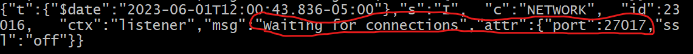

# Mongo Commands
### Connect to local server (In bash)
1. activate local server port
  - ```bash
    mongod
    ```
  - activate success when we see "Waiting for connection" and port number
    
2. connect with mongo shell
  - ```bash
    mongosh
    ```

### Show all database
- ```bash
  show dbs
  ```

## Create Operation

### Create a new database
- ```bash
  use <database name>
  ```

### Insert an object to database
- ```bash
  db.<database name>.insertOne(
    {
      name: "tim",
      age: 26
    }
  )
  ```   
- if database does not exist, it will create one.
   

## Read Operation
### Find specific data
- ```bash
  db.<database name>.find(
    {
      name: "tim",
      age: 26
    }
  )
  ```  
### Find data in specific bound
- find data in database that has age > 10
- ```bash
  db.<database name>.find(
    {
      age: {$gt: 10}
    }
  )
  ```
